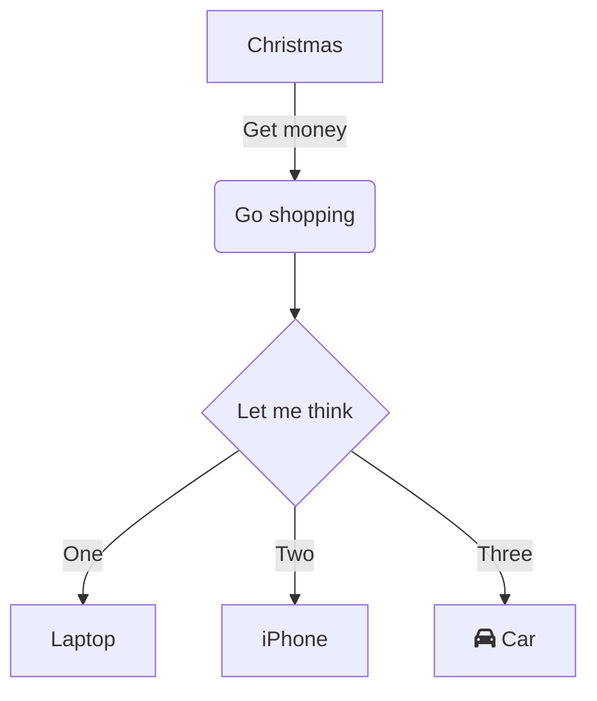
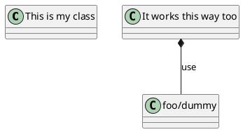

# Diagram Demo

## Mermaid

```mermaid
flowchart TD
    A[Christmas] -->|Get money| B(Go shopping)
    B --> C{Let me think}
    C -->|One| D[Laptop]
    C -->|Two| E[iPhone]
    C -->|Three| F[fa:fa-car Car]
```
## PlantUML

```plantuml
@startuml
class "This is my class" as class1
class class2 as "It works this way too"

class2 *-- "foo/dummy" : use
@enduml
```
